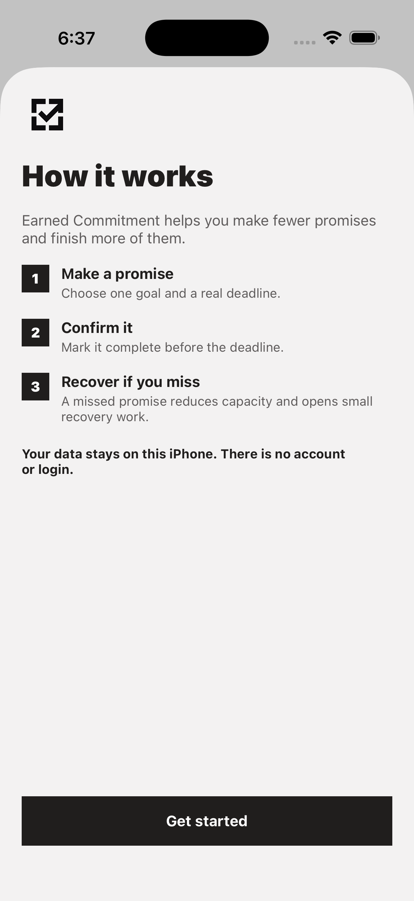
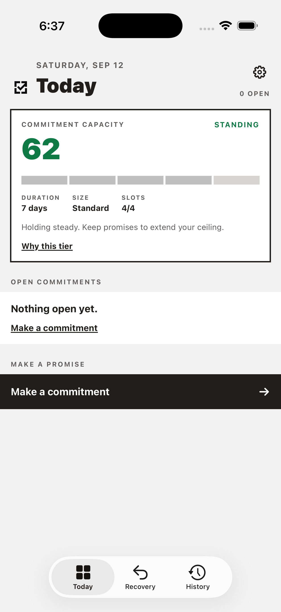
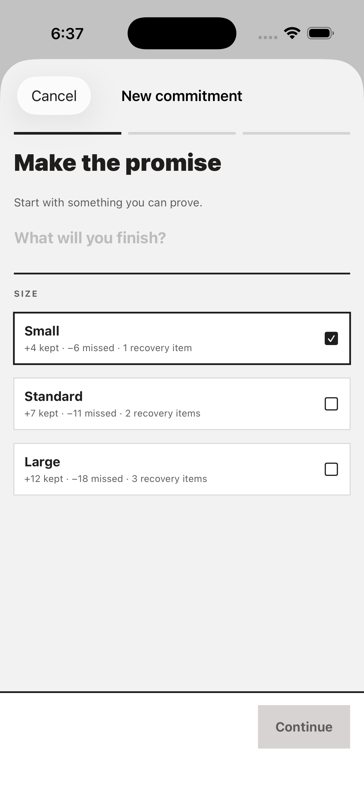
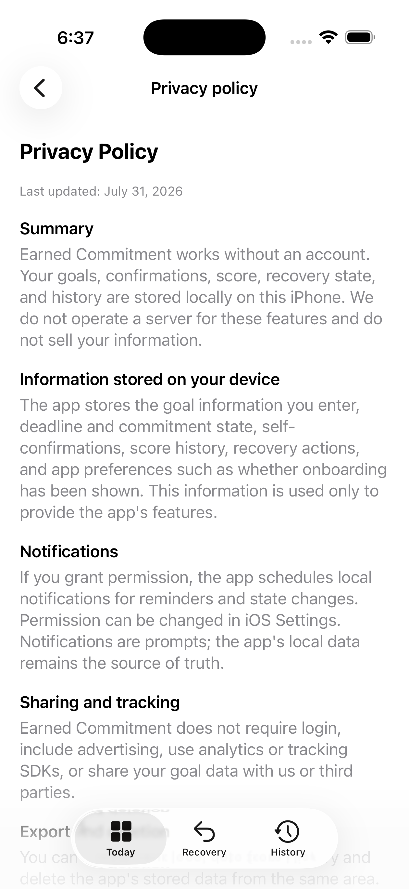
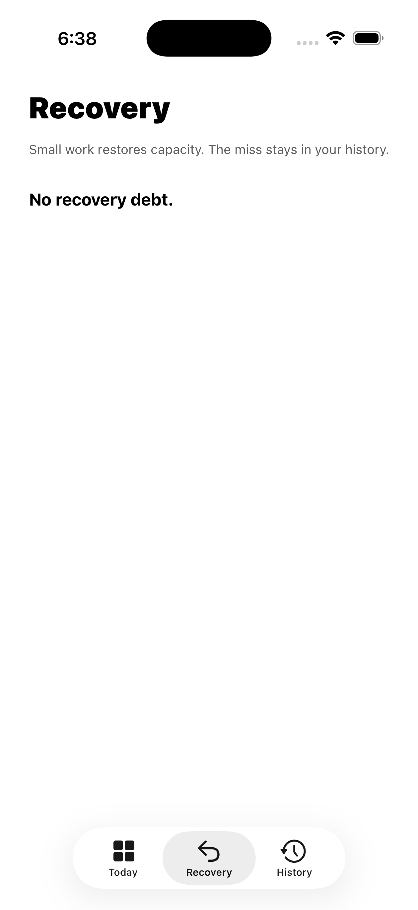

# Earned Commitment

Earned Commitment is an iOS app for turning a meaningful goal into a clear commitment with a deadline.

The user chooses a goal, confirms it themselves, and receives an honest capacity consequence if the deadline is missed. Recovery work restores that lost capacity in parts. The app does not require an account, login, photos, files, or social verification.

The app is built with SwiftUI and SwiftData. 

## Open in Xcode

Open `EarnedCommitment.xcodeproj`.

The source is in `App/`, tests are in `Tests/`, and release documentation is in `Docs/`.

The `Handoff/Earned Commitment` directory is a self-contained handoff copy for testing on another Mac. Keep source changes in the root project first, then sync the handoff copy with:

```bash
./scripts/sync_handoff_copy.sh
```

The old `GoalPenalty.xcodeproj` files are legacy generated artifacts. Do not use them for new builds.

## Demo

The current prototype flow:

| Onboarding | Today dashboard | New commitment |
| --- | --- | --- |
|  |  |  |

| Privacy | Recovery |
| --- | --- |
|  |  |
